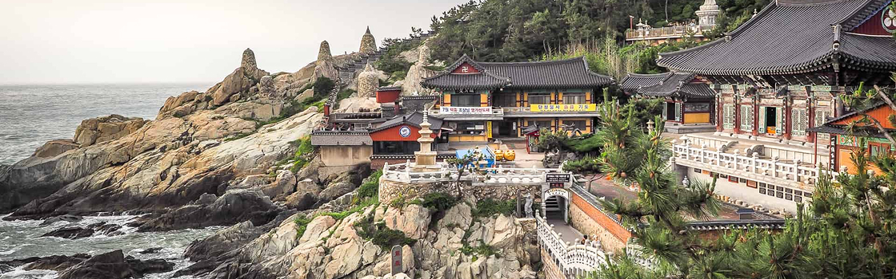

<h1 align="center"> Projeto 🗺️ Local Turístico </h1>

Projeto de desenvolvimento web inspirado no universo das viagens e descobertas culturais.  
O <strong>Local Turístico</strong> apresenta Busan, na Coreia do Sul, como destino, explorando templos, parques e atrações imperdíveis da cidade.  
Este projeto une meu aprendizado em <strong>HTML</strong> e <strong>CSS</strong> com a proposta de criar uma página informativa, organizada e visualmente agradável para compartilhar experiências de viagem.

  <a href="#-tecnologias">Tecnologias</a>&nbsp;&nbsp;&nbsp;|&nbsp;&nbsp;&nbsp;
  <a href="#-projeto">Projeto</a>&nbsp;&nbsp;&nbsp;|&nbsp;&nbsp;&nbsp;
  <a href="#-layout">Layout</a>&nbsp;&nbsp;&nbsp;

  

## 🚀 Tecnologias

Esse projeto foi desenvolvido com as seguintes tecnologias:

- HTML5  
- CSS3  
- Google Fonts (Open Sans, Alice)

## 💻 Projeto

Este projeto foi desenvolvido com foco em praticar conceitos fundamentais de front-end, como:

- Estruturação semântica em HTML  
- Estilização com CSS  
- Uso de listas ordenadas e seções para organização de conteúdo  
- Aplicação de fontes externas para identidade visual  

## 🔖 Layout

O projeto apresenta um design leve, limpo e voltado para **conteúdo informativo**, simulando uma página de guia turístico.  
Você pode visualizar o layout do projeto através [DESSE LINK](https://renatamayra.github.io/local-turistico/).  

---

Feito com ♥ por Renata Mayra ✨
